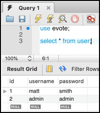

# evote-movie-2020-14-db-users

Rather than hard-coding the username/passwords that are valid, let's have an Entity class `User` and a corresponding database table `user`.



- Create a `User` Entity class with private properties and getters/setters for id / username / password

    - we'll also add the special SQL string constant to make it easy to create the DB table

    ```php
    <?php
    namespace Tudublin;
    
    class User
    {
        const CREATE_TABLE_SQL =
            <<<HERE
    CREATE TABLE IF NOT EXISTS user (
        id integer PRIMARY KEY AUTO_INCREMENT,
        username text,
        password text
    )
    HERE;
        
        private $id;
        private $username;
        private $password;
    
        public function getId()
        {
            return $this->id;
        }
    
        public function setId($id)
        {
            $this->id = $id;
        }
    
        public function getUsername()
        {
            return $this->username;
        }
    
        public function setUsername($username)
        {
            $this->username = $username;
        }
    
        public function getPassword()
        {
            return $this->password;
        }
    
        public function setPassword($password)
        {
            $this->password = $password;
        }
    }
    ```
-  create a `UserRepository` class:
    
    ```php
    <?php
    namespace Tudublin;
    
    use Mattsmithdev\PdoCrudRepo\DatabaseTableRepository;
    
    class UserRepository extends DatabaseTableRepository
    {
    }
    ```  

- the general approach to checking a username and password in the database is first to try to find a DB record with the same usernamer, and then to check the password (since passwords are usually hashed). So let's add a custom DB query method to the `UserRepository` class.

    ```php
    public function getUserByUserName($username)
    {
        // get DB connection object
        $db = new DatabaseManager();
        $connection = $db->getDbh();
    
        // create template SQL, with ':<var>' slot for parameter binding
        $sql = 'SELECT * FROM user WHERE (username = :username)';
    
        // create a preparedd SQL statement
        $statement = $connection->prepare($sql);
        
        // bind in parameter
        $statement->bindParam(':username', $username);
        
        // set fetch mode, so PDO returns us Objects rather than arrays
        $statement->setFetchMode(\PDO::FETCH_CLASS, $this->getClassNameForDbRecords());
        
        // execute the query
        $statement->execute();
    
        // retrieve the object (or get NULL if no row returned from query)
        $user = $statement->fetch();
        return $user;
    }
    ```
    - we have to add a `use` statement so we can use the library class `Mattsmithdev\PdoCrudRepo\DatabaseManager`

- we can now re-factor our `LoginController` method `checkCredentials(...)` to first get reecord from DB, and then checek its password against the one submitted in the login form by the user:
    
    ```php
    public function checkCredentials($username, $password)
    {
        $userRepository = new UserRepository();
        $user = $userRepository->getUserByUserName($username);
    
        if($user) {
            $passwordFromDatabase = $user->getPassword();
            if($password == $passwordFromDatabase){
                return true;
            }
        }
        
        return false;
    }
    ```

- Let's now create a new script to migrate and load into the DB username/password details for `matt/smtih` and `admin/admin`. We'll create a separate script for this `db/migrateAndLoadUserFixtures.php`:
    
    ```php
    <?php
    require_once __DIR__ . '/../config/dbConstants.php';
    require_once __DIR__ . '/../vendor/autoload.php';
    
    use Tudublin\UserRepository;
    use Tudublin\User;
    
    //--------- MOVIE ---------
    // (1) drop then create table
    $userRepository = new UserRepository();
    $userRepository->dropTable();
    $userRepository->createTable();
    
    // (2) delete any existing objects
    $userRepository->deleteAll();
    
    // (3) create objects
    $u1 = new User();
    $u1->setUsername('matt');
    $u1->setPassword('smith');
    
    $u2 = new User();
    $u2->setUsername('admin');
    $u2->setPassword('admin');
    
    // (3) insert objects into DB
    $userRepository->create($u1);
    $userRepository->create($u2);
    
    // (4) test objects are there
    $users = $userRepository->findAll();
    print '<pre>';
    var_dump($users);
    ```

    - when you run this at the command line it should confirm the data was inserted by var_dump'ing the 2 objects:
    
    ```bash
    php db/migrateAndLoadUserFixtures.php 
    --------------- DatabaseTableRepository->createTable() ----------------
    NOTE:: Looking for a constant CREATE_TABLE_SQL defined in the entity class associated with this repository
    -----------------------------------------------------------------------
    <pre>db/migrateAndLoadUserFixtures.php:33:
    array(2) {
      [0] =>
      class Tudublin\User#8 (3) {
        private $id =>
        string(1) "1"
        private $username =>
        string(4) "matt"
        private $password =>
        string(5) "smith"
      }
      [1] =>
      class Tudublin\User#9 (3) {
        private $id =>
        string(1) "2"
        private $username =>
        string(5) "admin"
        private $password =>
        string(5) "admin"
      }
    }
    ```
  